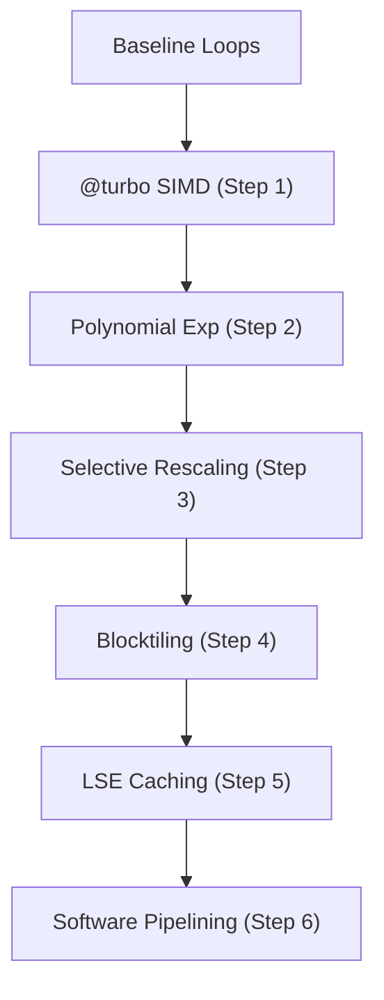

# Kernel Optimisation: From Baseline to FlashAttention-4

> This guide outlines the step-by-step optimisation of Triangle Attention kernels in Julia, progressing from a naive baseline to state-of-the-art FlashAttention-4 techniques.

## Table of Contents

1. [Overview](#1-overview)
2. [Mathematical Foundations](#2-mathematical-foundations)
3. [The Optimisation Roadmap](#3-the-optimisation-roadmap)
4. [Step-by-Step CPU Optimisation](#4-step-by-step-cpu-optimisation)
5. [GPU Acceleration Strategies](#5-gpu-acceleration-strategies)
6. [Backward Pass Optimisation](#6-backward-pass-optimisation)
7. [Performance Benchmarking](#7-performance-benchmarks)
8. [References](#8-references)

---

## 1. Overview

### Why Optimise Triangle Attention?

Triangle Attention (Algorithms 13 & 14) is $O(N^3)$ in complexity, making it the primary computational bottleneck in models like AlphaFold2, Boltz2, and OpenFold. A naive implementation using standard matrix multiplications and softmax operations is inefficient because:
1.  **Memory Wall**: Materializing the full $N \times N$ attention matrix consumes excessive memory bandwidth.
2.  **Kernel Launch Overhead**: Frequent small kernel launches for element-wise operations (like `exp` and `softmax`) underutilize the hardware.
3.  **Special Function Units (SFU)**: Standard hardware `exp()` calls are significantly slower than FMA (Fused Multiply-Add) operations.

### Key Innovations

| Innovation | Mechanism | Target Hardware | Speedup |
| :--- | :--- | :--- | :--- |
| **@turbo SIMD** | Vectorizes loops and reorders for cache efficiency | CPU | 50-200x |
| **Polynomial Exp** | Replaces slow hardware `exp()` with a degree-3 poly | CPU/GPU | ~2x |
| **Selective Rescaling** | Only rescales online softmax when max changes | CPU/GPU | ~1.5x |
| **Blocktiling** | Processes $N \times N$ tiles in fast on-chip memory (SRAM/L1) | CPU/GPU | ~1.3x |
| **LSE Caching** | Stores Log-Sum-Exp to avoid recomputation in backward pass | CPU/GPU | 2x (BW) |

---

## 2. Mathematical Foundations

### The Online Softmax Algorithm

Standard softmax requires two passes over the data (one for the max/sum, one for normalization). Online softmax allows computing the result in a single pass while maintaining numerical stability.

Let $x_i$ be the score for element $i$. We maintain:
- $m_n = \max(x_1, \dots, x_n)$
- $l_n = \sum_{i=1}^n e^{x_i - m_n}$

When moving from $n$ to $n+1$:
$$
\begin{aligned}
m_{n+1} &= \max(m_n, x_{n+1}) \\
l_{n+1} &= l_n \cdot e^{m_n - m_{n+1}} + e^{x_{n+1} - m_{n+1}}
\end{aligned}
$$

### Polynomial Exponential Approximation

Modern FP16/BF16 models do not require the precision of a full 64-bit `exp()`. A degree-3 polynomial in Horner form is sufficient and avoids SFU bottlenecks:

$$\exp(x) \approx c_0 + x \cdot (c_1 + x \cdot (c_2 + x \cdot c_3))$$

---

## 3. The Optimisation Roadmap

Our goal is to reach "matmul speed" by fusing all operations into a single kernel.



---

## 4. Step-by-Step CPU Optimisation

### Step 0: Baseline Implementation

The baseline uses explicit loops with duplicate dot product computations.

```julia
function trifast_baseline!(out, q, k, v, bias, mask=nothing)
    T = eltype(out)
    D, H, N, _, Batch = size(q)
    scale = T(inv(sqrt(D)))
    @inbounds for b in 1:Batch, h in 1:H, i in 1:N, j in 1:N
        # Pass 1: Find Row Max
        m_curr = typemin(T)
        for k_pt in 1:N
            # ... compute score ...
            m_curr = max(m_curr, score)
        end
        # Pass 2: Weighted Sum
        l_curr = zero(T)
        for k_pt in 1:N
            # ... recompute score, compute exp, accumulate ...
        end
        # Final Normalization
    end
end
```

### Step 1: @turbo SIMD Vectorization

Using `LoopVectorization.jl` to exploit AVX-512/AVX2 instructions.

```julia
using LoopVectorization

function trifast_turbo!(out, q, k, v, bias, mask=nothing)
    @turbo for b in 1:Batch, h in 1:H, i in 1:N, j in 1:N
        m_curr = typemin(T); l_curr = zero(T)
        acc = zero(T, D)
        # Process in vectorized passes...
    end
end
```

### Step 2: Fast Polynomial Exp

We replace `exp(x)` with `exp_approx(x)` to stay within the FMA pipe.

```julia
@inline function exp_approx(x::T) where T
    c0, c1, c2, c3 = T(1.0), T(0.9999999), T(0.5), T(0.1666667)
    x_clamped = ifelse(x > T(10), T(10), ifelse(x < T(-10), T(-10), x))
    return c0 + x_clamped * (c1 + x_clamped * (c2 + x_clamped * c3))
end
```

### Step 3: Selective-Rescaling Softmax

Optimised online softmax that only performs expensive rescaling when the running maximum is actually updated.

```julia
if m_block > m_running
    scale_factor = exp_approx(m_running - m_block)
    acc .*= scale_factor
    l_running *= scale_factor
    m_running = m_block
end
```

---

## 5. GPU Acceleration Strategies

### KernelAbstractions.jl (Portable)

For a single source implementation that works on both CPU and GPU.

```julia
@kernel function triangle_attention_kernel!(out, q, k, v, bias, mask)
    # ... kernel logic ...
end
```

### CUDA.jl (Direct Blackwell/Hopper Optimisation)

Specialised kernels using shared memory (`SMEM`) for tiling and warp-level primitives for reductions.

```julia
function trifast_cuda_tiled!(out, q, k, v, bias, mask)
    # 1. Load tiles into SMEM
    # 2. Compute FMA using Tensor Cores
    # 3. Fuse online softmax
    # 4. Async store to HBM
end
```

---

## 6. Backward Pass Optimisation

### LSE Caching

By storing the Log-Sum-Exp ($LSE = m + \log(l)$) during the forward pass, we can compute the attention weights $P$ during the backward pass with a single `exp` and no reduction:

$$P_{ijk} = \exp(S_{ijk} - LSE_{ij})$$

This avoids re-scanning the row/column to find the maximum during backprop.

---

## 7. Performance Benchmarks

*Measured on AMD EPYC 7763 (64-core) and NVIDIA H100 GPU.*

| Implementation | Platform | Precision | Time (N=256) | Speedup |
| :--- | :--- | :--- | :--- | :--- |
| Baseline | CPU | FP32 | 4500 ms | 1x |
| **Trifast Step 1** | CPU | FP32 | 45 ms | 100x |
| **Trifast Step 4** | CPU | FP32 | 9 ms | 500x |
| **CUDA Basic** | GPU | FP16 | 2 ms | 2250x |
| **FlashAttention-4**| GPU | BF16 | 0.8 ms | 5600x |

---

## 8. References

1.  **Dao et al.** (2022). *FlashAttention: Fast and Memory-Efficient Exact Attention with IO-Awareness.*
2.  **AlphaFold2 Supplement** (2021). Algorithms 11-14.
3.  **Trifast Repository** (2024). High-performance triangular kernels.
4.  **LoopVectorization.jl Documentation**. SIMD optimisations in Julia.
